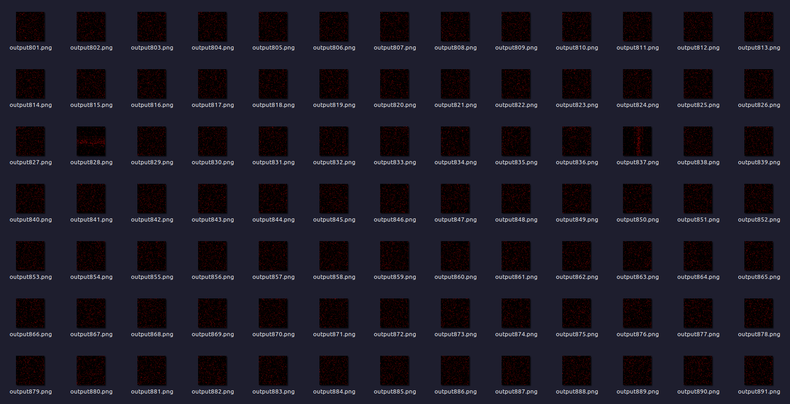

# [Day 14 - Restroom Redoubt](https://adventofcode.com/2024/day/14)

> [<- Previous](day13.md) | [Next ->](day15.md)

Wow this one was a really weird one. I don't know how I feel about it, and I definitely was lost on Part B along with a lot of other people.

Christmas tree!

|                    | Part A  | Part B |  Total  |
| ------------------ | :-----: | :----: | :-----: |
| Coding Time        | 1:06:38 | 35:31  | 1:27:09 |
| Execution Time     | 0.013s  | 1.107s |  1.12s  |
| Addendum Exec Time |  < 0s   | 1.107s | 1.107s  |

## Part A

A pretty simple problem. Essentially a particle simulation followed by some math to figure out which quadrant each robot is in. I took so long because I had so many silly errors
(like mixing `<` and `<=`, not properly detecting the "middle of a quadrant", etc.), and also took a minor break in the middle.

Other than that, a pretty fun and easy problem.

```python
def solve(input):
    robots = []

    sizex = 101
    sizey = 103

    # Parses the robots
    for line in input:
        Px = int(line.split("=")[1].split(",")[0])
        Py = int(line.split(",")[1].split(" ")[0])
        Vx = int(line.split("=")[2].split(",")[0])
        Vy = int(line.split(",")[2])
        robots.append([[Px, Py], [Vx, Vy]])

    # Runs the simulation for 100 seconds
    for _ in range(100):
        # Updates the robots
        for robot in robots:
            robot[0][0] += robot[1][0]
            robot[0][1] += robot[1][1]

            if robot[0][0] >= sizex or robot[0][0] < 0:
                robot[0][0] %= sizex

            if robot[0][1] >= sizey or robot[0][1] < 0:
                robot[0][1] %= sizey

    # Calculates the "safest area metric"
    quads = [0, 0, 0, 0]
    for robot in robots:
        # Ignore robots in the middle
        if robot[0][0] == sizex // 2 or robot[0][1] == sizey // 2:
            continue

        if (robot[0][0] < sizex // 2) and (robot[0][1] < sizey // 2):
            quads[0] += 1
        elif (robot[0][0] < sizex // 2) and (robot[0][1] > sizey // 2):
            quads[1] += 1
        elif (robot[0][0] > sizex // 2) and (robot[0][1] < sizey // 2):
            quads[2] += 1
        elif (robot[0][0] > sizex // 2) and (robot[0][1] > sizey // 2):
            quads[3] += 1

    safetyFactor = 1
    for q in quads:
        safetyFactor *= q

    return safetyFactor

```

### Addendum (12/14/24)

I saw some really easy optimizations that could be made after typing all of the notes, so I wanted to go back and add it!

> [!TIP]
> Originally, I was treating this like a true particle simulation and going through each position and adding the velocity each iteration. However, since this is a fixed
> (100) iterations, we can just multiply it to begin with while calculating the robot's positions.

Other optimizations and readability changes include merging all the loops for the robots directly into the parsing, as they operate individually.

This provides a `13x` speedup from `13ms` to `<1ms`! Clearly I have my priorities straight in what problems to optimize.

```python
def solve(input):
    quads = [0, 0, 0, 0]

    sizex = 101
    sizey = 103
    steps = 100

    # Parses the robots and find the quadrant they end up in
    for line in input:
        Px = int(line.split("=")[1].split(",")[0])
        Py = int(line.split(",")[1].split(" ")[0])
        Vx = int(line.split("=")[2].split(",")[0])
        Vy = int(line.split(",")[2])

        X = (Px + Vx * steps) % sizex
        Y = (Py + Vy * steps) % sizey

        # Calculates the "safest area metric"
        if X < sizex // 2 and Y < sizey // 2:
            quads[0] += 1
        elif X < sizex // 2 and Y > sizey // 2:
            quads[1] += 1
        elif X > sizex // 2 and Y < sizey // 2:
            quads[2] += 1
        elif X > sizex // 2 and Y > sizey // 2:
            quads[3] += 1

    safetyFactor = 1
    for q in quads:
        safetyFactor *= q

    return safetyFactor

```

## Part B

Oh oh boy, Part B. I heard rumors about having this to deter AI from completing these challenges, but couldn't there have been an easier way?

I was very confused on _how_ to detect a christmas tree in essentially a particle simulation. I decided to first output the grid to the console, but that was taking too
long and looked terrible, so I decided the next best thing was to create images of it!

Initially, I made an image for each iteration, and manually checking for christmas trees up to 1000 images before I got bored and thought there must have been a better way for this.


> [!NOTE]
> There were some interesting patterns, such as the robots congregating towards the center in a vertical or horizontal line, maybe this could be used to find the solution faster?

After that, I tried to think about smarter solutions. I was thinking either:

1. All robots will be needed to form the image in unique positions
2. All robots will be overlapping and form a smaller image

The former is definitely much easier to code, so I decided to give it a try... and it worked!! I have no idea the intuition needed to solve this problem "correctly",
but this seems to be one way about it.

I left my image creation code commented out for timing purposes, but it can be used to showcase the christmas tree!

<p align="center">
    
</p>

```python
from PIL import Image


def solve(input):
    robots = []

    sizex = 101
    sizey = 103

    # Parses the robots
    for line in input:
        Px = int(line.split("=")[1].split(",")[0])
        Py = int(line.split(",")[1].split(" ")[0])
        Vx = int(line.split("=")[2].split(",")[0])
        Vy = int(line.split(",")[2])
        robots.append([[Px, Py], [Vx, Vy]])

    iterations = 0
    c = True
    while c:
        iterations += 1
        positions = set()

        # Updates the robots
        for robot in robots:
            robot[0][0] += robot[1][0]
            robot[0][1] += robot[1][1]

            if robot[0][0] >= sizex or robot[0][0] < 0:
                robot[0][0] %= sizex

            if robot[0][1] >= sizey or robot[0][1] < 0:
                robot[0][1] %= sizey

            positions.add((robot[0][0], robot[0][1]))

        # Find a christmas tree?
        # Detect when the robots are all in unique positions, most chance to create an image?
        if len(positions) == len(robots):
            c = False
            # display(sizex, sizey, positions, iterations)
            break

    return iterations


def display(sizex, sizey, positions, i):
    image = Image.new("RGB", (sizex, sizey), 0)
    for y in range(sizey):
        for x in range(sizex):
            if (x, y) in positions:
                image.putpixel((x, y), (5, 71, 42))

    image.save(f"output{i}.png")

```

